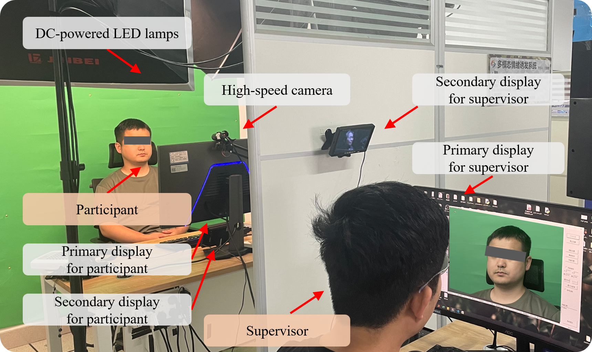

# CMCL-Net: A Cross-Modal Contrastive Learning Network for Micro-Expression Spotting Enhanced by Electrocardiogram Signals

# Abstract

Micro-expressions (ME) are brief and spontaneous facial movements that reveal genuine human emotions. The first and foremost step for ME analysis is ME spotting, which aims to accurately identify frame sequences containing MEs within video data. Emotional arousal not only induces transient contractions of facial muscles but also triggers synchronized cascading responses in the autonomic nervous system. Nevertheless, existing ME spotting methods primarily rely on unimodal facial visual information, without fully exploring the potential auxiliary role of physiological signals. Given that electrocardiogram (ECG) signals effectively capture variations in autonomic nervous system activity during emotional arousal, they hold promise as physiological cues for detecting MEs. This study investigates the correlation between MEs and ECG signals, proposing a multimodal framework that leverages complementary information for automatic ME spotting to assess the feasibility of incorporating ECG data into ME analysis. Specifically, we first constructed a strictly synchronized multimodal dataset, termed MECG, comprising simultaneously recorded facial videos and ECG signals. Statistical analysis of this dataset revealed significant correlations between MEs and specific ECG signal features. Subsequently, we developed a Transformer-based Cross-Modal Contrastive Learning Network (CMCL-Net) to achieve preliminary detection of ME samples. To further enhance detection accuracy, we introduced a candidate clip filtering module that utilizes HR slope as an additional screening criterion, effectively reducing the model's false detection rate. Experimental results demonstrate the superior performance of CMCL-Net on the MECG dataset. To the best of our knowledge, this study is the first to incorporate objective physiological signals into the ME spotting task, providing a novel perspective for ME analysis.

# Experimental environment

The experimental environment for MECG dataset:

