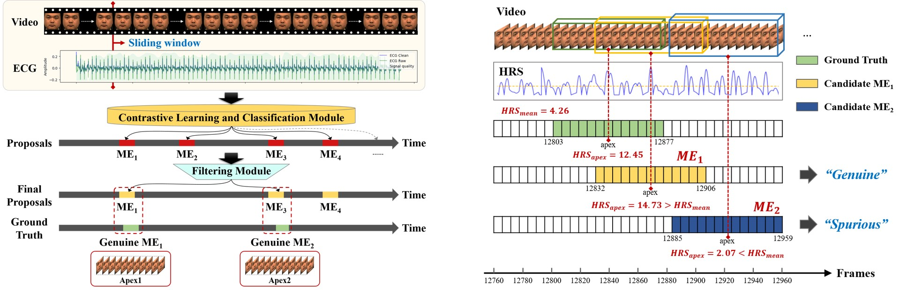

# CMCL-Net: A Cross-Modal Contrastive Learning Network for Micro-Expression Spotting Enhanced by Electrocardiogram Signals

# Abstract

Micro-expressions (ME) are brief and spontaneous facial movements that reveal genuine human emotions. The first and foremost step for ME analysis is ME spotting, which aims to accurately identify frame sequences containing MEs within video data. Emotional arousal not only induces transient contractions of facial muscles but also triggers synchronized cascading responses in the autonomic nervous system. Nevertheless, existing ME spotting methods primarily rely on unimodal facial visual information, without fully exploring the potential auxiliary role of physiological signals. Given that electrocardiogram (ECG) signals effectively capture variations in autonomic nervous system activity during emotional arousal, they hold promise as physiological cues for detecting MEs. This study investigates the correlation between MEs and ECG signals, proposing a multimodal framework that leverages complementary information for automatic ME spotting to assess the feasibility of incorporating ECG data into ME analysis. Specifically, we first constructed a strictly synchronized multimodal dataset, termed MECG, comprising simultaneously recorded facial videos and ECG signals. Statistical analysis of this dataset revealed significant correlations between MEs and specific ECG signal features. Subsequently, we developed a Transformer-based Cross-Modal Contrastive Learning Network (CMCL-Net) to achieve preliminary detection of ME samples. To further enhance detection accuracy, we introduced a candidate clip filtering module that utilizes HR slope as an additional screening criterion, effectively reducing the model's false detection rate. Experimental results demonstrate the superior performance of CMCL-Net on the MECG dataset. To the best of our knowledge, this study is the first to incorporate objective physiological signals into the ME spotting task, providing a novel perspective for ME analysis.

# Experimental environment

Facial images were captured using the XIMEA high-speed camera at a frame rate of 150 frames per second and a resolution of 2,040 × 1,080 pixels. ECG signals were recorded using the BIOPAC MP160 data acquisition system at a sampling rate of 1,000 Hz. A shared trigger between the camera and the BIOPAC system was used to generate timestamps, ensuring precise synchronization between facial images and ECG signal acquisition. The experimental environment for MECG dataset:

# ME annotation proces

Two well-trained annotators with expertise in Facial Action Coding System (FACS), utilized a custom-developed video annotation software to examine the recorded raw videos frame by frame, accurately identifying the onset, apex, and offset frames of each expression sequence. After excluding emotion-irrelevant artifacts (e.g., frequent blinking caused by dry eyelids or habitual mouth movements), facial expression sequences with a total duration of no more than 500 milliseconds (ms) from onset to offset, or no more than 250 ms from onset to apex, were classified as ME samples. Subsequently, the annotators labeled each sample with Action Units (AUs) and assigned it to one of seven emotion categories: happiness, surprise, sadness, fear, anger, disgust, or contempt.

# Visual inspection

To conduct visual inspection, we present a representative example of ECG signals, HR curve, and the slope of the HR curve during a one-minute trial, as shown in Fig. \ref{fig: Heart Rate Slope}. The upper panel displays the ECG signal waveform, the middle panel shows the temporal trend of heart rate, and the lower panel depicts the variation in heart rate slope. Red vertical lines indicate the precise timestamps of three ME apex frames in this trial, occurring at 14,350 ms, 37,190 ms, and 41,180 ms. The processing and feature extraction of ECG were performed using the open-source neurophysiological signal processing toolkit NeuroKit2 (https://neurokit2.readthedocs.io/).

# Cross-Modal Contrastive Learning Network

we propose a cross-modal contrastive learning network (CMCL-Net) to enhance ME spotting by integrating ECG signals. The detailed pipeline is outlined as follows:

(i) Sample Pair Generation Module: This module generates positive and negative sample pairs. Positive pairs consist of two ME samples, whereas negative pairs include one ME sample and one non-ME sample. Each sample integrates a facial video sequence with corresponding ECG data aligned within a temporal window. (ii) Contrastive Learning and Classification Module: Utilizing the generated sample pairs, this module performs contrastive learning and classification, comprising pre-training and fine-tuning stages. During pre-training, a triplet loss function optimizes the cross-modal feature encoder by maximizing the distance between fused features of negative pairs while minimizing the distance between those of positive pairs. In the fine-tuning phase, the pre-trained feature encoder processes sample features, which are subsequently classified as ME or non-ME by a classifier. A classification loss function refines the parameters of both the feature encoder and the classifier. (iii) Candidate Clip Filtering (CCF) Module: Post-processing is conducted by the CCF module, which evaluates samples based on the instantaneous heart rate slope (HRS) of the apex frame. Samples with an HRS exceeding a predefined threshold are classified as genuine MEs, while those below the threshold are deemed spurious and excluded.

# Cross-modal feature encoder

We introduce a cross-modal feature encoder designed to capture joint features from video and ECG data. The encoder adopts a dual-stream structure, which independently processes video and ECG features prior to their fusion. Each stream comprises a patch embedding (PE) module, a cross-attention block (CAB), and a multilayer perceptron (MLP). To stabilize training and accelerate model convergence, layer normalization is applied before each CAB and MLP, while residual connections are incorporated to further bolster the network's robustness and representational capacity.

# Candidate clip filter module

Among the detected candidate ME clips, only a subset represents genuine MEs, with the remainder being false positives attributed to noise or artifacts. To refine these candidates, we introduce a Candidate Clip Filter (CCF) module that incorporates the heart rate slope (HRS) as an additional validation metric. Our analysis reveals that intense emotional states activate the sympathetic nervous system, resulting in elevated heart rates and more pronounced transient changes in HR (quantified by HRS values) at the apex of MEs. Consequently, a candidate ME is classified as genuine if the HRS at its apex frame exceeds η times the trial’s average slope value; otherwise, it is deemed spurious.

# Experiments

# Coding file

The dataset annotation file is shown in the figure below:

# How to Apply for the Dataset

To apply for this dataset, please download the "Release Agreement.pdf" file, print it, fill in the required information by hand, and send the scanned copy to the email address: ustb_machuang@163.com.

